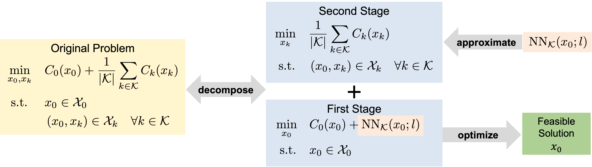

# Approximate-and-Optimize for SCOPF
Repository for `An Approximate-and-Optimize Method for
Security-Constrained AC Optimal Power Flow`

## Components
<!--  -->

  

There are two parts in this repository:
- **approx-optimize-scopf**: 
    Implemented in Julia, mainly containing the codes for `decompose` and `optimize`, as well as for collecting base case solutions for training the surrogate model.
- **scopf-approx**: Implemented in Python, mainly containing the codes for `approximate`, that is to train the surrogate neural network. The part for generating generating scenario datasets is also included in this module.

For more details, please refer to the `README.md` for each module respectively.

## Acknowledgment
This work is supported by the National Key R\&D Program of China (Grant No. 2022YFA1003900), Shenzhen Science and Technology Program (Grant No.
RCBS20221008093309021), National Natural Science Foundation of China (Grant No.
12301416), Guangdong Basic and Applied Basic Research Foundation (Grant No. 2024A1515010306), and Longgang District Special Funds for Science and Technology Innovation (Grant No. LGKCSDPT2023002).

## Citing
- **Jinxin Xiong, Shunbo Lei, Akang Wang, Xiaodong Luo**. "An Approximate-and-Optimize Method for Security-Constrained AC Optimal Power Flow".